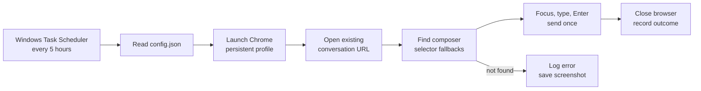

# ChatGPT Auto Hello

A small Windows automation tool that sends one configured message to a chosen, existing ChatGPT conversation every 5 hours (or another configured interval). Built with Python 3.12+, Playwright, Google Chrome, and Windows Task Scheduler. Your first login is manual; later runs reuse a **separate, persistent browser profile**. No password is stored by this project.



The task needs a signed-in, unlocked Windows desktop and an awake computer with internet access. It opens Chrome for each run and closes it afterward; you do not need to keep a browser or terminal window open. `--test` **really sends** a message. Sending `hello` does **not** guarantee any particular ChatGPT usage-limit reset.
**Because only sending hello may consume too few input and output tokens**.So what I use is to send a sentence every five hours, "Please help me summarize the latest paper published by arxiv in the last five hours and give a link." In actual testing, the billing for the five-hour quota window can be turned on.

## 1. Install

Unzip this project to a permanent folder, for example `C:\Users\you\chatgpt-auto-hello`. In PowerShell, from that folder:

```powershell
py -3.12 -m venv .venv
.\.venv\Scripts\python.exe -m pip install -r requirements.txt
Copy-Item config.example.json config.json
```

The app now uses your installed Google Chrome executable. You do **not** need to install Playwright's Chromium browser. If `py -3.12` is unavailable, install Python 3.12+ first. Keep the project folder at the same path after installing the task.

**Upgrading from the earlier Chromium ZIP:** copy the new `app.py`, `install_task.bat`, `README.md` and `requirements.txt` over the old files. Keep your existing `config.json` so your conversation URL is preserved. If that config does not contain `browser_executable`, the app automatically uses `C:\Program Files\Google\Chrome\Application\chrome.exe`.

## 2. Configure and log in

Open your local `config.json`. Replace `conversation_url` with the URL of an existing conversation from your browser address bar (`https://chatgpt.com/c/...`). The provided `message` is `hello`, and `interval_hours` is `5`. `browser_executable` points to `C:\Program Files\Google\Chrome\Application\chrome.exe`; change it if your Chrome is elsewhere. Save as UTF-8. This file is gitignored; commit only `config.example.json`, never your real conversation URL.

Run:

```powershell
.\.venv\Scripts\python.exe app.py --login
```

The program opens **ordinary Chrome without Playwright for this login step**. Log in manually in that Chrome window (including Google sign-in if you use it). **Close that dedicated Chrome window completely**, leaving your everyday Chrome windows alone; then press Enter in PowerShell. The program briefly opens the same profile with Playwright to verify the configured conversation, then closes it. It never asks for or stores your password. Chrome keeps session cookies and local storage under `%LOCALAPPDATA%\ChatGPTAutoHello\chrome-profile`; treat that directory as sensitive and do not share it. If your login expires, repeat `--login`.

This uses your installed `chrome.exe` but **does not reuse the already open, signed-in Chrome profile**. Chrome/Playwright cannot safely automate the default Chrome profile; using its normal `User Data` directory, or pointing Playwright at your already-running Chrome, is not supported. The old `%LOCALAPPDATA%\ChatGPTAutoHello\browser-profile` from the Chromium version is left intact and unused. If ordinary Chrome with the separate profile also rejects Google sign-in, changing the executable alone will not solve it; using the existing browser session would require a different desktop automation or browser extension design.

## 3. Test and schedule

```powershell
.\.venv\Scripts\python.exe app.py --test
.\install_task.bat
```

The first command sends **one real `hello`** now; run it only when ready. The batch file registers or updates the task `ChatGPT Auto Hello` for the currently signed-in user without storing a Windows password. Its first scheduled run is about 10 seconds after installation; it repeats every `interval_hours` hours (default 5). You can inspect it in Task Scheduler. Task installation uses Windows PowerShell's ScheduledTasks module; if registration is restricted by your organization, ask your administrator. The task's interactive logon setting means it runs only while this user is logged in. Locked desktops and Windows foreground restrictions can prevent activation; the run then fails safely without sending.

To change the interval, edit `config.json` and rerun `install_task.bat`. To change only the conversation or message, edit `config.json`; the next run reads the new values. To remove the task in PowerShell:

```powershell
Unregister-ScheduledTask -TaskName 'ChatGPT Auto Hello' -Confirm:$false
```

## Troubleshooting

- Logs: `%LOCALAPPDATA%\ChatGPTAutoHello\app.log`. Screenshots of failures: `%LOCALAPPDATA%\ChatGPTAutoHello\screenshots\` (screenshots can contain private conversation content).
- If you see `Login expired`, run `--login` again. A missing composer or a redirected conversation produces a log entry and screenshot; confirm the URL and inspect the page.
- Do not keep the utility's dedicated Chrome profile open in another process: Chrome cannot launch two browser instances with the same profile. A Windows named mutex and Task Scheduler's `IgnoreNew` policy avoid overlapping runs.
- The program never retries Enter automatically after an uncertain send. Check the conversation and log before a manual retry.
- ChatGPT's page structure can change. If the composer selector breaks, update `EDITOR_SELECTORS` in `app.py` based on the current UI.

Implementation references: [Playwright persistent contexts](https://playwright.dev/python/docs/api/class-browsertype#browser-type-launch-persistent-context), [Chrome profile restrictions](https://developer.chrome.com/blog/remote-debugging-port), [Windows repetition triggers](https://learn.microsoft.com/en-us/powershell/module/scheduledtasks/new-scheduledtasktrigger), [interactive principals](https://learn.microsoft.com/en-us/powershell/module/scheduledtasks/new-scheduledtaskprincipal), and [multiple-instance settings](https://learn.microsoft.com/en-us/powershell/module/scheduledtasks/new-scheduledtasksettingsset).
